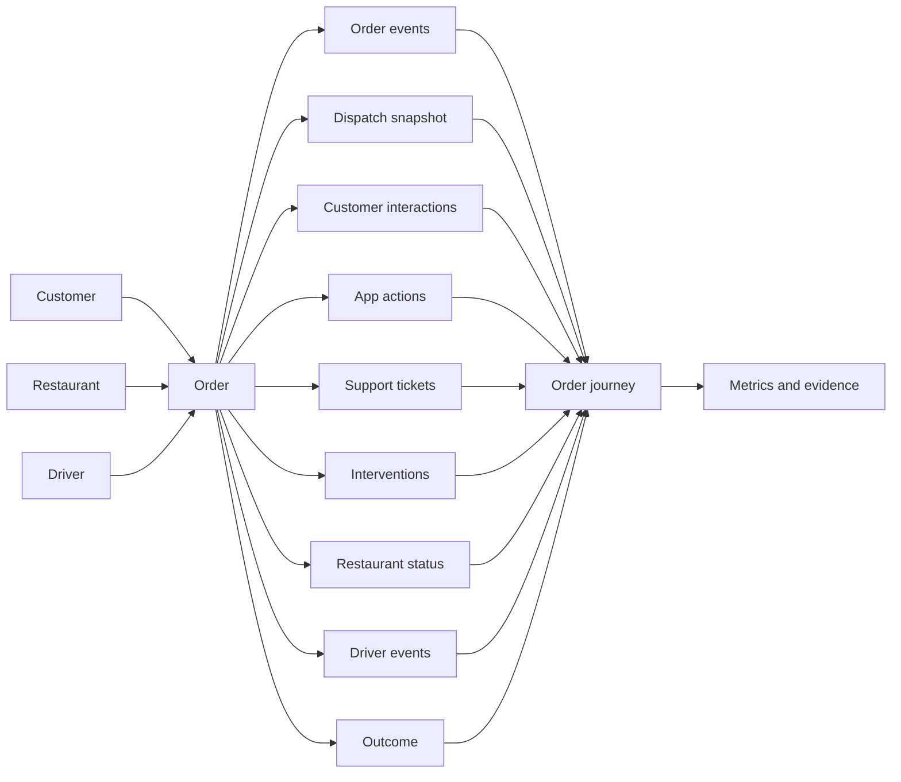

# Workflow and data model

The canonical analytical grain is one row per `order_id`. One-to-many sources are aggregated before joining to prevent row multiplication.



## Core entities and facts

| Model object | Key | Grain | Main use |
|---|---|---|---|
| `dim_customer` | `customer_id` | One customer | Customer reference |
| `dim_restaurant` | `restaurant_id` | One restaurant | Cuisine and restaurant reference |
| `dim_driver` | `driver_id` | One driver | Vehicle and experience reference |
| `fact_order` | `order_id` | One order | Order timestamps and conditions |
| `fact_order_outcome` | `order_id` | One order | Late flag, delay, outcome bucket |
| `fact_order_event` | `event_id` | One event | Lifecycle and intervention evidence |
| `fact_dispatch` | `order_id` | One API snapshot/order | Assignment, ETA, reassignment |
| `fact_customer_interaction` | `interaction_id` | One interaction | Customer friction signals |
| `fact_app_action` | `action_id` | One app action | ETA views, support, cancellation attempts |
| `fact_support_ticket` | `ticket_id` | One ticket | Complaint evidence |
| `fact_intervention` | `intervention_id` | One intervention | Operational response |
| `fact_driver_event` | Driver/order/event | One driver event | Movement and delivery evidence |

## KPI linkage

```text
Reduce late delivery rate
        ↓
Late delivery rate + median delay
        ↓
Order-to-pickup time + customer friction rate
        ↓
Intervention coverage and intervention/outcome association
        ↓
Order, outcome, customer, support, dispatch, restaurant, and driver sources
```

The model can identify associations and workflow concentration. It cannot prove that an intervention caused an improvement because interventions are not randomly assigned.
